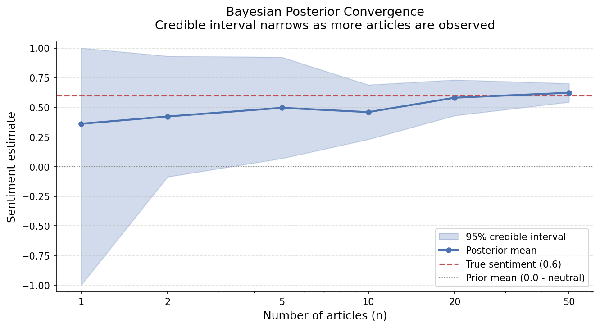
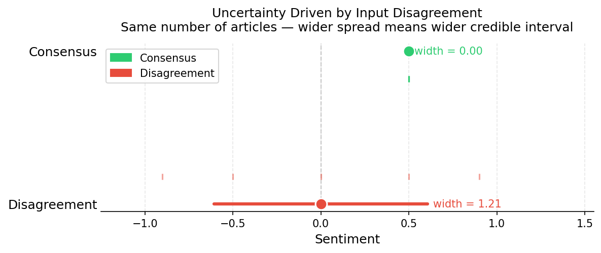
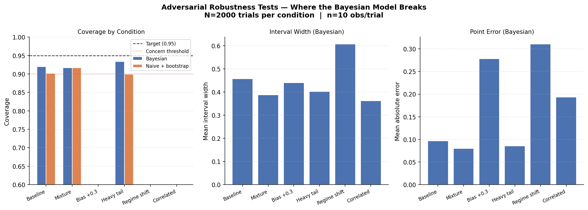

# KiwiPulse

A Bayesian system for aggregating noisy sentiment signals with explicit uncertainty quantification.

Most sentiment pipelines return a score. This one returns a score, a 95% credible interval, and a measure of how much to trust it - derived from disagreement between sources, not added as an afterthought.

---

## The problem

The standard pipeline:

```
articles → LLM → average score → 0.72
```

A score from two articles looks identical to one from fifty. Sources that contradict each other produce the same output as sources that agree, just noisier. And LLM confidence scores aren't calibrated - they're guesses dressed as probabilities.

The result is false precision.

---

## How it works

Each LLM-produced sentiment score is treated as a noisy observation of a true latent signal μ:

```
x_i ~ Normal(μ, σ²)    - each score is a noisy measurement
μ   ~ Normal(0, 1)     - prior: neutral before seeing evidence
σ²  = max(Var(scores), 0.10)   - estimated from data, floored
```

The Normal-Normal conjugate gives a closed-form posterior. No sampling, no black box. High disagreement between sources → high σ² → wider interval. The uncertainty is a direct consequence of the data.

**Output for each batch of articles:**

```json
{
  "mean": 0.41,
  "lower_bound": 0.18,
  "upper_bound": 0.64,
  "variance": 0.014,
  "sample_size": 8
}
```

---

## Key insight

Uncertainty is not added after the fact - it emerges directly from disagreement in the data.

---

## Decision rule

```
lower_bound > 0  → predict positive
upper_bound < 0  → predict negative
otherwise        → abstain
```

The model doesn't try to be right all the time. It tries to be right when it chooses to act.

Simulation across 5,000 runs: 99.2% accuracy when acting, 40% abstain rate - versus 92% accuracy with 0% abstain for a baseline that always commits. The tradeoff is explicit and tunable.

---

## Architecture

```
POST /analyze
      │
      ▼
RawTextInput[]        ← Pydantic v2, strict validation, UTC timestamps
      │
      ▼
LLM Scoring           ← GPT-4o-mini, temperature=0, JSON mode
(per article)            score ∈ [-1, 1], validated explicitly
      │
      ▼
Bayesian Update       ← Normal-Normal conjugate, closed-form posterior
estimate_market()        floored empirical Bayes for σ²
      │
      ▼
MarketEstimate        ← mean, lower_bound, upper_bound, variance, n
```

```
src/
├── core/bayesian_model.py         # inference - the statistical core
├── core/truncated_normal_model.py # grid-integration alternative (see analysis)
├── llm/sentiment.py               # LLM boundary - isolated and mockable
├── schema/models.py               # data contracts - Pydantic v2
├── api/routes.py                  # FastAPI - validation + error routing
└── main.py
```

---

## Key engineering decisions

**Variance floor.** Raw sample variance at n=2 gave 69.6% empirical coverage vs the 95% nominal target. A floor of 0.10 brings this to 92.6%. Domain justification: LLM scores always carry some irreducible noise.

**No LLM confidence scores.** LLM self-reported confidence isn't calibrated. Uncertainty comes entirely from the statistical distribution of scores.

**Isolated LLM boundary.** `_call_llm` is separated from `_parse_and_validate`. The parsing logic is fully unit-testable without API calls.

**422 vs 503.** Parsing failures return 422 (bad input). API failures return 503 (dependency down). Different failure modes, different codes.

**Lazy client initialisation.** The OpenAI client is initialised on first use, so importing the module doesn't require `OPENAI_API_KEY` - tests run without it.

---

## What the analysis found

**Calibration** (`scripts/calibration_test.py`): empirical coverage sits at 88–92% vs the 95% nominal target. Three causes: asymmetric clamping near ±1, Gaussian likelihood mismatch on bounded data, and empirical Bayes σ² instability at small n. All three are quantified.

**Adversarial testing** (`scripts/adversarial_tests.py`): systematic scoring bias drops coverage to 35%. Correlated observations (AR ρ=0.7) drop it to 52%. The model is surprisingly robust to mixture noise and heavy tails - σ² adapts automatically. These are the real failure modes in production.

**Truncated Normal** (`scripts/truncated_normal_comparison.py`): the theoretically correct fix for bounded data requires numerical grid integration since conjugacy breaks. After implementing it, calibration comparison showed no meaningful improvement over the floored Gaussian - the variance floor had already addressed the primary failure mode. The implementation is correct; the result is informative.

**Sensitivity analysis** (`scripts/sensitivity_analysis.py`): coverage tested across τ² ∈ {0.25, 1.0, 4.0}, σ ∈ {0.2, 0.4, 0.6}, n ∈ {5, 10, 20}. Prior choice varies coverage by less than 0.2pp across a 16× range. Data dominates at n ≥ 5.

**Real-world validation** (`scripts/real_world_validation.py`): 30 trading days Jan–Feb 2025, real SPY returns, hand-curated headlines. Aggregation vs single headline: +3.4pp accuracy. Abstain rule vs naive mean: +11.4pp at 43% coverage cost. Caveat: scores were hand-assigned with date knowledge - possible look-ahead bias. Proof-of-concept, not a backtest.

---

## Visualizations

Posterior convergence - credible interval narrows as n grows:



Uncertainty from disagreement - same n, different spread:



Adversarial failure modes - where the model breaks:



---

## Running locally

```bash
git clone https://github.com/bonnie-mcconnell/kiwi-pulse
cd kiwi-pulse
pip install -e ".[dev]"

# Tests - no API key required
pytest tests/ -v

# API (requires OPENAI_API_KEY)
export OPENAI_API_KEY=your_key
uvicorn main:app --reload

# Analysis scripts - no API key needed
python scripts/demo_real_articles.py
python scripts/visualize_convergence.py
python scripts/adversarial_tests.py
python scripts/real_world_validation.py
```

See `scripts/README.md` for the full list and what each script shows.

---

## Limitations

- Gaussian likelihood assumes unimodal symmetric noise - wrong near boundaries and wrong when sources are correlated
- Treats all sources equally - no credibility weighting
- Variance floor is a domain assumption, not estimated from data
- Real-world validation used hand-scored data; look-ahead bias cannot be ruled out
- Calibration gap (~89% vs 95% nominal) is partly structural - bounded domain plus Gaussian assumptions

This is a statistical aggregation layer, not a ground-truth oracle.

---

## Further reading

`WRITEUP.md` covers the full technical arc: what was tried, what failed, why the truncated Normal didn't help, and what the real-world results actually mean.
